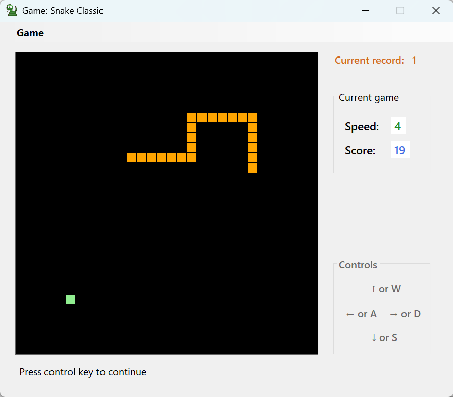

# SnakeGame

**A classic Snake arcade game built in C# WinForms.**  
Eat, grow, avoid walls and your own tail.

Game window:

---

## Features

- Speed levels
- Score counter
- Keyboard controls
- Pixel-art style

---

## Tech Stack

- **C#**
- **Windows Forms (WinForms)**
- **.NET Framework 4.8**
- **Developed with Microsoft Visual Studio**

---

## Getting Started

git clone https://github.com/snstanislav/SnakeClassic.git